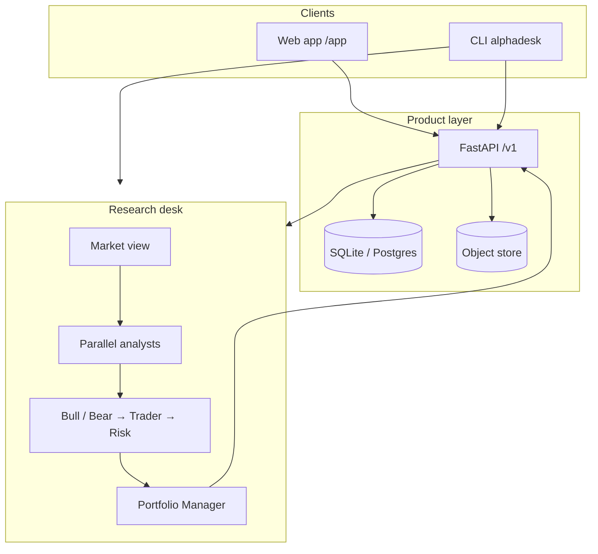

# AlphaDesk

Portfolio-aware multi-agent research desk for serious self-directed investors.

AlphaDesk runs parallel LLM analysts over a name (and your book), turns the output into evidence-linked theses, and keeps portfolio, research, and journal state in a durable workspace. Research and decision support only — not trading advice or execution.

Fork of [TradingAgents](https://github.com/TauricResearch/TradingAgents). CLI/distribution: `alphadesk`; Python import package: `tradingagents`.

---

## Architecture



**Surfaces:** Intelligence · Portfolio · Research · Workbench (runs/theses) · Journal · Settings  
**Core loop:** import book → research a name → review evidence → accept thesis → journal outcome

---

## Install

Python **3.10+** (3.12 recommended).

```bash
git clone https://github.com/himanshuagarwal456/alphadesk.git
cd alphadesk

python3 -m venv .venv
source .venv/bin/activate          # Windows: .venv\Scripts\activate

pip install -e ".[server,dev,ui]"
cp .env.example .env               # add LLM provider keys for live runs
alembic upgrade head
alphadesk-api
```

| | URL |
|---|---|
| App | http://127.0.0.1:8000/app/ |
| API | http://127.0.0.1:8000/v1 |
| Docs | http://127.0.0.1:8000/docs |

**Learn More:** open **Intelligence** (or click **Try Learn More** on Workbench) → **Create demo card** → **Learn More** on the card. On the FinTok feed (`alphadesk-feed`), thesis-change cards include a **Learn More** button with embedded concept explanations.

Defaults use SQLite and an object store under `~/.tradingagents/`. Point `ALPHADESK_DATABASE_URL` at Postgres when needed, then re-run `alembic upgrade head`.

```bash
# .env (minimum for live research)
OPENAI_API_KEY=...                 # or GOOGLE_ / ANTHROPIC_ / etc.
```

Until auth lands, the API scopes workspaces with `X-Workspace-Id` (default `ws_local`).

**CLI-only** (no API/UI): `pip install .` then `alphadesk`.

---

## License & credit

Apache 2.0 — see [`LICENSE`](LICENSE).

Built on [TradingAgents](https://github.com/TauricResearch/TradingAgents) (Xiao, Sun, Luo, Wang). Cite [arXiv:2412.20138](https://arxiv.org/abs/2412.20138) if you use this work. Product plan: [`docs/alpha-release.md`](docs/alpha-release.md).
