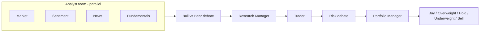
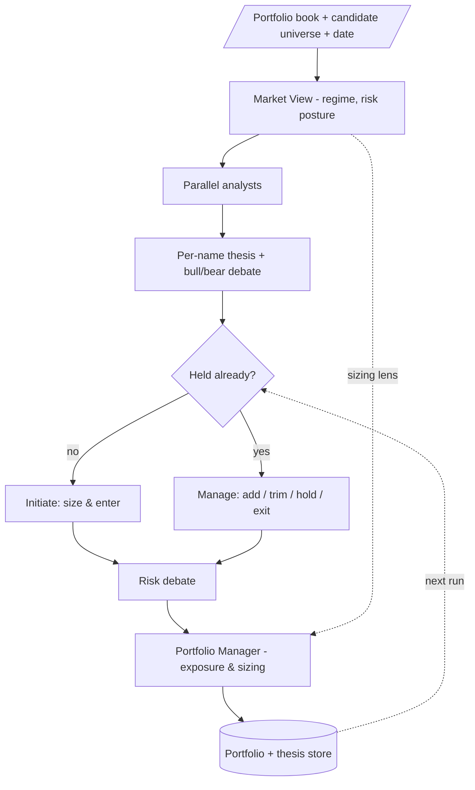

# AlphaDesk — Portfolio-Aware Multi-Agent Trading Framework

> **AlphaDesk** is a fork of [TauricResearch/TradingAgents](https://github.com/TauricResearch/TradingAgents) that evolves the framework from a stateless, single-ticker decision engine toward a **portfolio-aware, hedge-fund-style system**: parallel analysts, an existing book as a first-class input, and a lifecycle that forms a view, sizes a position, and manages it over time.
>
> *The distribution and CLI are named `alphadesk`; the Python import package remains `tradingagents` for backward compatibility with upstream.*

<p align="center">
  
</p>

> ⚠️ **Research only.** This framework is for studying multi-agent LLM analysis. Trading performance varies with the backbone models, temperature, data quality, and market conditions. Nothing here is financial, investment, or trading advice.

---

## What this fork adds

This fork keeps the original multi-agent architecture intact and layers on capabilities aimed at behaving more like a real desk:

| Capability | Status | Summary |
|-----------|--------|---------|
| **Portfolio-aware feed (FinTok)** | ✅ Shipped (v1) | Agents' knowledge rendered as a swipeable vertical feed of single-name narratives — chart cards arced *hook → evidence → tension → verdict* — ranked by how much each story matters to *your* book. `alphadesk-feed --demo`. |
| **Parallel analyst execution** | ✅ Shipped | The four analysts run concurrently (isolated message channels, fan-out/fan-in) instead of a serial chain — bounded by the slowest analyst rather than their sum. |
| **Portfolio ingestion & book model** | ✅ Shipped | Load an existing portfolio from a broker CSV export into a structured, exposure-aware book (`tradingagents/portfolio/`). |
| **Deterministic portfolio store** | ✅ Shipped | JSON-backed, date-snapshotted persistence — a foundation for reproducible, replayable runs. |
| **Portfolio-aware decisioning** | ✅ Shipped | Held names route to *manage/exit* and new candidates to *initiate*; the Portfolio Manager reasons about exposure, concentration, and cash. Run the whole book (holdings + watchlist) in one call. |
| **Top-down Market View** | ✅ Shipped | A `MarketViewBuilder` synthesizes FRED macro series + global headlines into a regime + sizing bias, threaded into every name as a sizing lens (deterministic store included). |
| **Position lifecycle** | 🗺️ Planned | Persistent per-name thesis with invalidation triggers; initiate → manage → exit. |
| **Options & backtest harness** | 🗺️ Planned | An options-strategy agent and a `backtrader`-driven replay clock. |

See [Roadmap](#roadmap) for the full direction.

---

## Original framework

TradingAgents mirrors the structure of a trading firm with specialized LLM agents that collaborate — and debate — to reach a decision.

### Analyst team (run in parallel)
- **Market / Technical Analyst** — price action and indicators (MACD, RSI, Bollinger, ...).
- **Sentiment Analyst** — news, StockTwits, and Reddit fused into a sentiment read.
- **News Analyst** — global headlines, macro indicators (FRED), and prediction markets (Polymarket).
- **Fundamentals Analyst** — financial statements, profile, and history.

### Research team
- **Bull** and **Bear** researchers debate the analysts' findings; a **Research Manager** synthesizes a plan.

### Execution & risk
- The **Trader** turns the plan into a concrete proposal.
- **Aggressive / Conservative / Neutral** risk debators stress-test it, and the **Portfolio Manager** issues the final call.



Built on **LangGraph** for modularity, with support for many LLM providers: OpenAI, Google Gemini, Anthropic, xAI, DeepSeek, Qwen, GLM, MiniMax, OpenRouter, Groq, Mistral, NVIDIA, Ollama (local), Azure, and AWS Bedrock.

---

## Installation

Requires **Python 3.10+** (3.12 recommended).

```bash
git clone https://github.com/himanshuagarwal456/alphadesk.git
cd alphadesk

python3 -m venv .venv
source .venv/bin/activate        # Windows: .venv\Scripts\activate

pip install --upgrade pip
pip install .
```

> **Note:** the system Python on macOS (Command Line Tools) is often 3.9 and will fail dependency resolution. Use a 3.10+ interpreter (`python3.12`, Homebrew, `pyenv`, or `conda`).

### Docker

```bash
cp .env.example .env    # add your API keys
docker compose run --rm alphadesk
```

---

## Configuration

Copy the template and set the key(s) for your chosen provider:

```bash
cp .env.example .env
```

```bash
OPENAI_API_KEY=...          # OpenAI (GPT)
GOOGLE_API_KEY=...          # Google (Gemini)
ANTHROPIC_API_KEY=...       # Anthropic (Claude)
# ... see .env.example for all providers

FRED_API_KEY=...            # optional: macro data (free key)
ALPHA_VANTAGE_API_KEY=...   # optional: alternate market/news/fundamentals vendor
```

Any `TRADINGAGENTS_*` variable overrides the matching key in `tradingagents/default_config.py` without editing code — e.g. `TRADINGAGENTS_LLM_PROVIDER`, `TRADINGAGENTS_DEEP_THINK_LLM`, `TRADINGAGENTS_MAX_DEBATE_ROUNDS`.

---

## Usage

### CLI

```bash
alphadesk                # interactive: pick ticker, date, models, depth
tradingagents            # back-compat alias for the same CLI
python -m cli.main       # equivalent, from source
```

Works with any Yahoo-Finance-covered market via exchange-suffixed tickers: `AAPL`, `SPY`, `0700.HK`, `7203.T`, `RELIANCE.NS`, `600519.SS`, `BTC-USD`.

### Python

```python
from tradingagents.graph.trading_graph import TradingAgentsGraph
from tradingagents.default_config import DEFAULT_CONFIG

config = DEFAULT_CONFIG.copy()
config["llm_provider"] = "openai"
config["deep_think_llm"] = "gpt-5.5"
config["quick_think_llm"] = "gpt-5.4-mini"

ta = TradingAgentsGraph(debug=True, config=config)
_, decision = ta.propagate("NVDA", "2026-01-15")
print(decision)
```

### Portfolio ingestion (new)

Load an existing book from a broker CSV export and inspect exposure:

```python
from tradingagents.portfolio import load_portfolio_from_csv, PortfolioStore

book = load_portfolio_from_csv("fidelity_export.csv", as_of="2026-01-15")

book.holds("NVDA")        # True  -> a held name (manage / exit path)
book.concentration        # 0.39  -> largest single-name weight
book.net_exposure         # net long/short the desk carries
book.total_value          # positions + cash

# Deterministic, date-snapshotted persistence (replay foundation)
store = PortfolioStore("~/.tradingagents/portfolio")
store.save(book)
store.snapshot(book)      # keyed by as_of, for backtest replay
```

The loader handles common broker header variants (Fidelity, Schwab, IBKR, Robinhood, ...), `$`/comma/`(negative)` formatting, cash/sweep rows, and custom column maps. Positions carry signed quantities, so shorts and direction-aware P&L are first-class.

### Portfolio-aware decisions (new)

Pass the book to a run and the Portfolio Manager becomes portfolio-aware: held names route to *manage/exit* and new candidates to *initiate*, with exposure, concentration, and cash as constraints. An optional `market_view` acts as a top-down sizing lens.

```python
from tradingagents.graph.trading_graph import TradingAgentsGraph
from tradingagents.portfolio import load_portfolio_from_csv, run_book

book = load_portfolio_from_csv("fidelity_export.csv", as_of="2026-01-15")
ta = TradingAgentsGraph(config=config)

# Single name, aware of the book (NVDA held -> "manage", TSLA new -> "initiate")
_, decision = ta.propagate("NVDA", "2026-01-15", portfolio=book,
                           market_view="Risk-off; trim high-beta into strength.")

# Or sweep the whole book at once: every holding (manage) + each candidate (initiate)
results = run_book(ta, "2026-01-15", book, watchlist=["TSLA", "MSFT"])
for symbol, r in results.items():
    print(symbol, r["stance"], r.get("decision", r.get("error")))
```

### Top-down Market View (new)

Form the desk's macro regime and risk posture once, then apply it as a sizing lens across the whole book. The builder turns FRED macro series (rates, curve, inflation, labor, growth, VIX) plus global headlines into a structured `MarketView`.

```python
from tradingagents.market_view import MarketViewStore

view = ta.build_market_view("2026-01-15")   # -> MarketView(regime, sizing_bias, ...)
print(view.regime, view.sizing_bias, view.confidence)

# Persist it (deterministic, date-snapshotted) and thread it through the book run
MarketViewStore("~/.tradingagents/market_view").snapshot(view)
results = run_book(ta, "2026-01-15", book, watchlist=["TSLA", "MSFT"], market_view=view)
```

### Portfolio-aware feed — "FinTok" (new)

The idea: **use the agents to generate knowledge, visualize it, and disseminate it in a vertical feed.** Each completed run becomes a *narrative* — a horizontal album of chart cards that tells that name's story (`hook → evidence → tension → verdict`) — and narratives are stacked vertically, ranked by how much each one matters to *your* book (conviction × signal × portfolio weight).

The feed is a self-contained HTML page (CSS scroll-snap for the two-axis swipe, Plotly.js for interactive charts) — no server or build step. Install the extra and try the demo:

```bash
pip install ".[ui]"
alphadesk-feed --demo                          # sample feed, no API/network
alphadesk-feed --portfolio book.csv            # build from your saved runs, portfolio-aware
```

```python
from tradingagents.ui import build_feed, write_feed_html, load_saved_runs

runs = load_saved_runs("~/.tradingagents/logs")          # past runs on disk
feed = build_feed(runs, portfolio=book)                  # ranked narratives
write_feed_html(feed, "feed.html")                       # open in any browser
```

> v1 covers single-name narratives. Theme/macro narratives (one story spanning several names) and a real swipe front-end are next.

---

## Roadmap

The goal is to behave less like a one-shot stock picker and more like a fund that carries state:



- [x] Parallel analyst execution
- [x] Portfolio-aware insight feed (FinTok) — single-name narratives, chart cards, dominance ranking
- [ ] Theme / macro narratives (one story spanning multiple names) + real swipe front-end
- [x] Portfolio book model + broker-CSV ingestion + deterministic store
- [x] Thread the book (and market view) through graph state
- [x] Initiate vs. manage/exit routing per name
- [x] Portfolio-aware Portfolio Manager (exposure / concentration / cash constraints)
- [x] Run the whole book at once (holdings + candidate watchlist)
- [x] Automated top-down Market View builder (macro narrative as a sizing lens)
- [ ] Persistent per-name thesis with invalidation triggers
- [ ] Options-strategy agent
- [ ] `backtrader` replay/backtest harness

---

## Persistence

- **Decision log** (always on): each run appends its decision to `~/.tradingagents/memory/trading_memory.md`. On the next same-ticker run, the realized return (raw and alpha vs. benchmark) is fetched, reflected on, and injected into the Portfolio Manager prompt — so the system carries forward what worked. Override with `TRADINGAGENTS_MEMORY_LOG_PATH`.
- **Checkpoint resume** (opt-in via `--checkpoint`): LangGraph saves state after each node so a crashed run resumes instead of restarting. Per-ticker SQLite DBs live under `~/.tradingagents/cache/checkpoints/`; `--clear-checkpoints` resets them.

---

## Reproducibility

LLM output is non-deterministic, and live data (news, social) moves over time, so two runs of the same ticker/date can differ — expected for an LLM research tool. Lower `temperature` (or `TRADINGAGENTS_TEMPERATURE`) to reduce variation on models that honor it; reasoning models largely ignore it, so use a non-reasoning model for tighter repeatability. Company identity is resolved deterministically from the ticker, and the market analyst grounds exact price/indicator claims in a verified snapshot. The portfolio store is byte-stable and date-snapshotted to support reproducible, replayable runs.

---

## Development

```bash
pip install ".[dev]"
python -m pytest -q -m "not integration"   # unit + structure tests
ruff check .
```

---

## Credits

This project is a fork of **[TradingAgents](https://github.com/TauricResearch/TradingAgents)** by Tauric Research (Yijia Xiao, Edward Sun, Di Luo, Wei Wang). All original architecture, agent design, and research are credited to the upstream authors. This fork adds the portfolio-awareness and hedge-fund-lifecycle direction described above.

## License

Apache License 2.0 — see [`LICENSE`](LICENSE). This fork preserves the upstream license and attribution.

## Citation

If you use this work, please cite the original TradingAgents paper:

```bibtex
@misc{xiao2025tradingagentsmultiagentsllmfinancial,
      title={TradingAgents: Multi-Agents LLM Financial Trading Framework},
      author={Yijia Xiao and Edward Sun and Di Luo and Wei Wang},
      year={2025},
      eprint={2412.20138},
      archivePrefix={arXiv},
      primaryClass={q-fin.TR},
      url={https://arxiv.org/abs/2412.20138},
}
```
